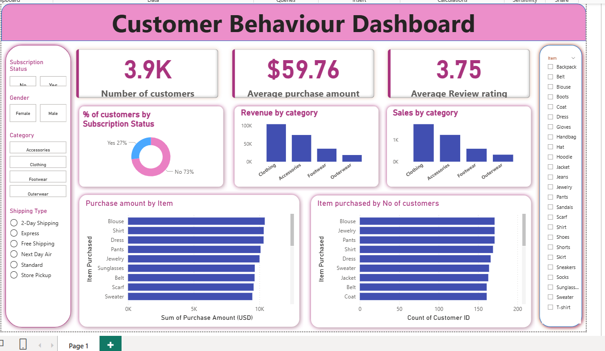

# Customer Shopping Analysis – Power BI Dashboard

## Overview
This project presents an interactive **Customer Behaviour Dashboard** developed in **Power BI** to analyze shopping patterns and customer engagement.  
The dashboard highlights customer demographics, purchase trends, product demand, and subscription status impact on spending behaviour.

---

## Dashboard Preview

  

---

## Business Objectives
This dashboard helps businesses to:
- Understand **customer shopping behaviour**
- Identify **high-demand product categories**
- Track **average purchase amount & customer satisfaction**
- Measure **subscription status impact on revenue**
- Optimize **targeted marketing campaigns**

---

## Key Insights from the Dashboard
- **Total Customers:** 3.9K  
- **Average Purchase Amount:** $59.76  
- **Average Review Rating:** 3.75  

Additional insights:
- Only **27% of customers are subscribers** — opportunity to increase subscription adoption
- **Clothing** generated the **highest revenue and most sales**
- Top items purchased by amount include **Blouse, Shirt, Dress, Pants, and Jewelry**
- **2-Day Shipping & Express** had the highest usage among shipping types

---

## Dataset Description
| Attribute | Details |
|----------|---------|
| Dataset Name | Customer Shopping Behavior |
| Format | CSV (.csv) |
| Rows Include | Customer demographics, shopping preference & order details |
| Key Metrics | Purchase amount, subscription status, item purchased, review score |

---

## Tools & Technologies Used
| Technology | Purpose |
|-----------|---------|
| Power BI Desktop | Dashboard Development & Visual Analysis |
| Power Query | Data Cleaning & Transformation |
| DAX | Calculated Measures |
| CSV | Data Source |

---

## Repository Structure
Customer_Shopping_Analysis_PowerBI/
│── Customer_Sales_Dashboard.pbix
│── customer_shopping_behavior.csv
│── customer_dashboard.png
│── README.md

---

## Future Enhancements
- Add **RFM (Recency–Frequency–Monetary) customer segmentation**
- Include **churn prediction / retention modeling**
- Publish **interactive live dashboard using Power BI Service**

---

## Author
**Abhi – Power BI Developer & Data Analyst**  
Skilled in creating Data Visualizations, BI Dashboards & Business Insights

If you found this project useful, please ⭐ star the repository!
